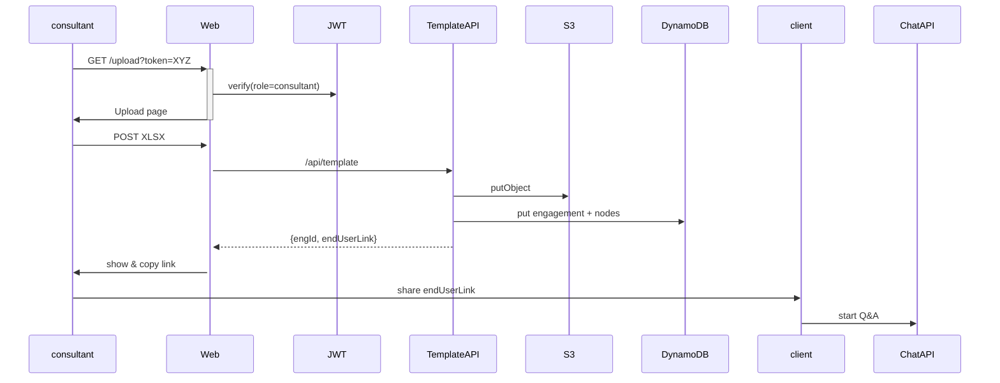

# AWS Migration Discovery Web App — **Product Requirements Document**  
**Version:** 1.2 (Upload & Magic-link page added) **Date:** 3 July 2025  
**Author:** *TBC* **Audience:** Mantel Group AWS engineering team, Claude / LLM code-gen agents

---

## 0 Reference Implementation

```
ai-info-webapp/
├─ src/
│  ├─ app/
│  │  ├─ api/
│  │  │  ├─ gather/
│  │  │  │   └─ route.ts           # Q&A streaming & ASC
│  │  │  ├─ template/
│  │  │  │   └─ route.ts           # **NEW** XLSX upload
│  │  │  ├─ export/
│  │  │  │   └─ route.ts           # Spreadsheet generation
│  │  ├─ upload/                   # **NEW** consultant UI
│  │  │   └─ page.tsx
│  │  ├─ globals.css
│  │  ├─ layout.tsx
│  │  └─ page.tsx                  # End-user chat UI
│  ├─ lib/
│  │  ├─ utils.ts
│  │  └─ llm/ (claude.ts, bedrock.ts, index.ts)
└─ …configs & assets
```

---

## 1 Problem Statement  
*(unchanged)*

---

## 2 Goals & Success Metrics  
*(unchanged)*

---

## 3 Target Users & Personas  

| Persona | Needs | Pain Points Today |
|---------|-------|-------------------|
| **Consultant** | Upload template once and obtain magic link to share. | Manual e-mailing of large XLSX; no self-serve link. |
| *Others* | *See v1.0* | |

---

## 4 User Stories (additions)

*4.* *As an AWS consultant* I can visit a secure “Upload Template” page, drag-and-drop the XLSX, and immediately receive a unique magic link (copied to clipboard) so that I can send it to client respondents.

---

## 5 Functional Requirements (delta)

| Ref | Requirement | Component |
|-----|-------------|-----------|
| **F-0 Upload Page UI** | `/upload` (server component `src/app/upload/page.tsx`) is gated by a time-limited **consultant magic-link** (see Auth below). Provides: file chooser (accept `.xlsx`), progress bar, success toast with generated end-user magic-link. | React + Tailwind |
| **F-0a Consultant Magic-Link Auth** | A *single-use* link (JWT) is e-mailed to the consultant by internal tooling. Visiting `/upload?token=…` sets an `auth=consultant` cookie valid for 1 h. | `middleware.ts` |
| **F-1 Template Upload API** | `POST /api/template` (was F-1) now consumes `multipart/form-data`; returns JSON: `{ engagementId, endUserLink }`. | `src/app/api/template/route.ts` |
| **F-1b End-User Magic-Link Generation** | Generated as: `https://<host>/?eng=<id>&token=<jwt>` (JWT scoped to `engagementId`, 30-day validity, read-only). Copied to clipboard and displayed in UI. |
| **F-6 Export Gatekeeper** | On valid export, *consultant* receives e-mail with download link; end-user tokens become invalid (status → exported). |
| *All other F-n* | *unchanged (see v1.1)* |

---

## 6 Conversational & Upload UX Requirements

| ID | Requirement |
|----|-------------|
| **UX-UP-1** | Upload page uses Mantel Group colours, logo, and a large drag-and-drop zone with dashed border. |
| **UX-UP-2** | After upload, show “Magic link copied ✅” and a button **‣ Copy again**. |
| **UX-UP-3** | Display lightweight checklist of next steps (“Share the link with client SMEs; monitor progress in Admin API”). |
| **CX requirements** | *unchanged for chat UI* |

---

## 7 Data & Auth Flow



---

## 8 Non-Functional Additions

| Area | Requirement |
|------|-------------|
| **Authentication** | JWTs issued by internal script (`npm run create-link --role=consultant`) using `JWT_SECRET`. |
| **Security** | Consultant upload tokens expire after 1 hour or on first successful upload (whichever comes first). |
| **Accessibility (Upload)** | Drag-and-drop area also supports keyboard “Enter/Space” to trigger file picker. |

---

## 9 Architecture Diagram (updated fragment)

```
               ┌──────────────┐
(Consultant) ─►│ /upload page │
               └─────┬────────┘
                     │POST XLSX
                     ▼
          /api/template (route.ts)
                     │creates
                     ▼
          Engagement in DynamoDB
                     │
          magic link  ▼
         ──────────> Chat UI (client)
```

*(Rest of diagram unchanged.)*

---

## 10 Acceptance Criteria (additional)

8. **Upload link**: Visiting `/upload` without valid consultant token redirects to 403 page.  
9. **Single use**: Re-visiting the same consultant magic link after a successful upload shows “Link expired”.  
10. **End-user link** opens chat with pre-loaded template and no ability to upload a new file.  
11. **Clipboard**: Copy-to-clipboard button tested in Cypress across Chrome, Edge, Safari.  

*(Criteria 1 – 7 unchanged.)*

---

## 11 Timeline (incremental)

| Sprint | New PRs |
|--------|---------|
| 0 | **PR-0a** Auth middleware & CLI to generate consultant links. |
| 1 | **PR-1a** `/upload` page + drag-drop component.<br>**PR-1b** `/api/template` multipart handler. |
| 2 – 4 | *unchanged from v1.1* |

---

## 12 Risks (new)

| Risk | Mitigation |
|------|------------|
| Consultant forgets to purge upload token email | Token auto-expires after first use. |
| Large XLSX > API Gateway limit | Enforce max 10 MB client-side; advise consultants to remove unused sheets. |

---

*All other sections remain as in Version 1.1.*

**End of Document**
